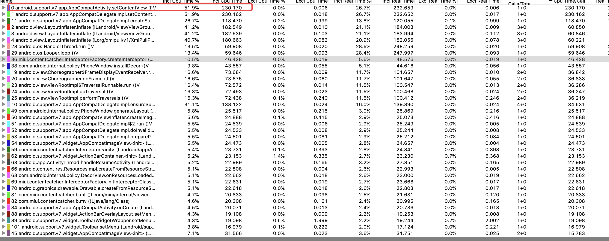
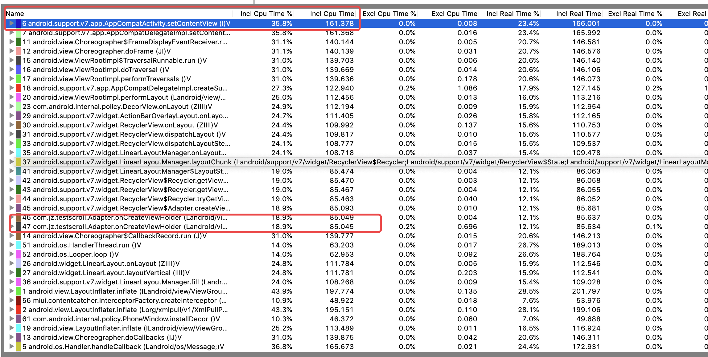

# 垂直滑动方案布局性能测试记录

##  ScrollView

### 时间毫秒计算

多次计算值
onWindowFocusChanged - onCreate

__热启动：__
80、106、106、103、102、112、114

__冷启动：__
209、202、203、234、240、242、228

trace文件，也是在上面两个方法之间：
类型名+启动方式+启动时长

结论：

时间计算值发现启动的时长不稳定，好的时候启动很快，差的时候启动页会有较大的增长，尤其是冷启动时；tarce文件分析，总体启动时长大于recycle类型，截图上也看得出setContentView启动时长230.170

## RecycleView

多次计算值
onWindowFocusChanged - onCreate 

__热启动：__
110、103、99、98、103

__冷启动：__
231、233、222、221、230

trace文件同上，在当前路径下

结论：

时间计算方式得出启动时长相对稳定，从与scroll方式相当；由于代码实现方面多了一个recycle的adapter，不过adapter花费时长较少，主要集中在onCreateViewHolder内部的inflater引入资源文件，并且Activity的SetContentView时长加上inflater时长只比scroll多10微秒，及其微小，并且总体启动时长还小于scroll，故recycle启动优化大于scroll

## 目的

利用Android device monitor和trace工具，深度定位每一个步骤执行效率，已确定出最终的方案

__所以在选择滑动布局方面，建议选择recycle，recycle理想性能与scroll相当，甚至有时更优，启动稳定，除此之外功能更强于scroll，更适合复杂的UI布局__

